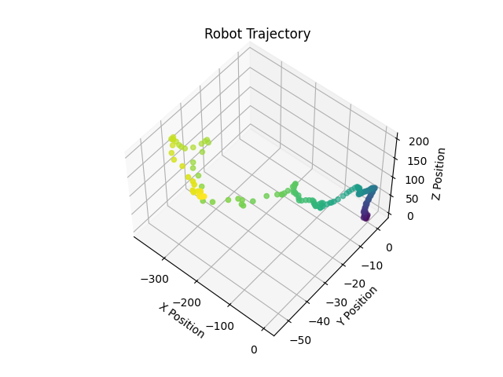
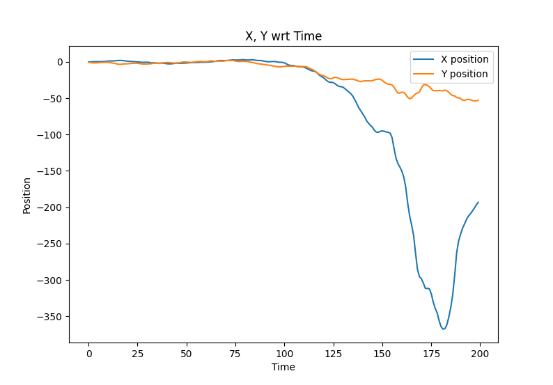
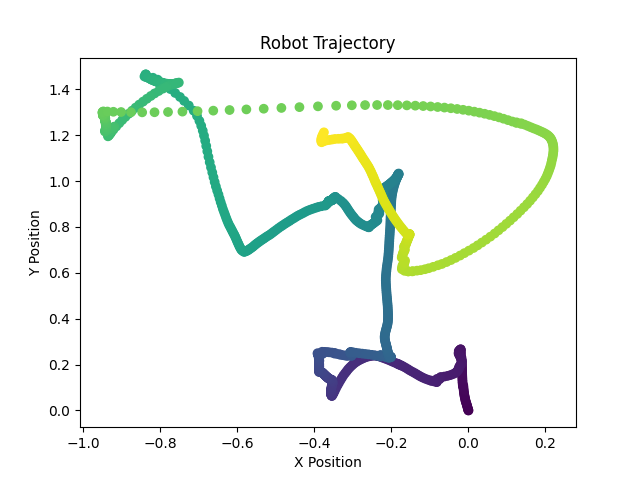
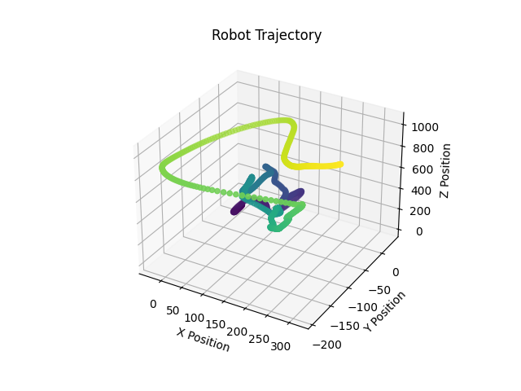
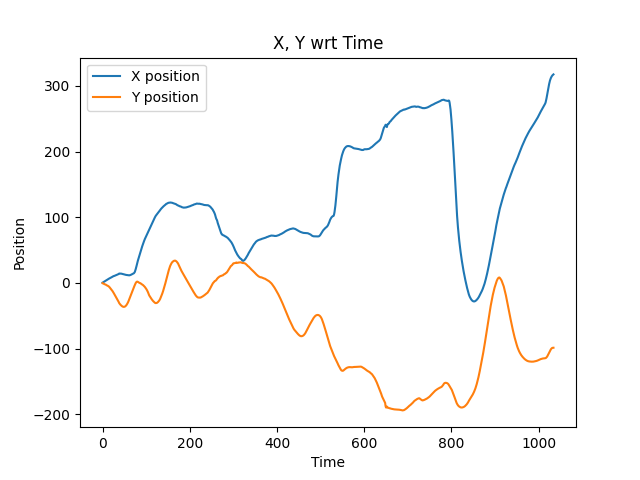
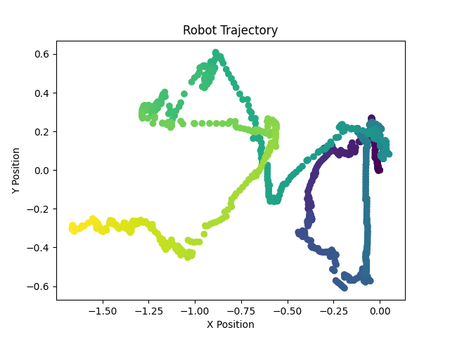
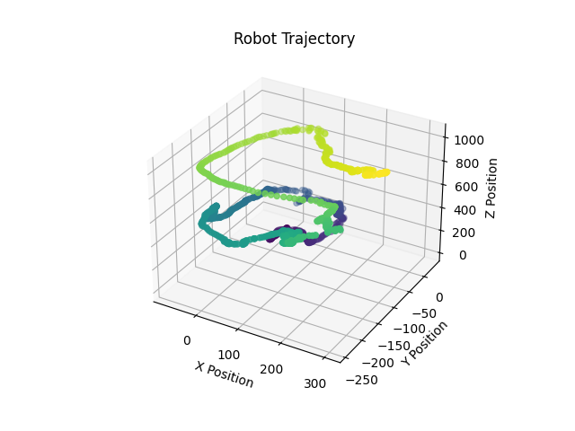
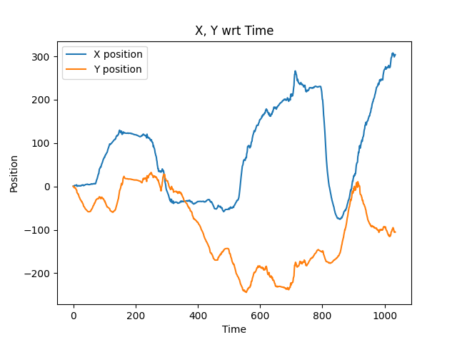

# Frontier Exploration - Hands-on Planning

# TV Poster

No change after rescaling the first homography matrix

# Underwater Poster

## Using SIFT

**x-y trajectory**

**3D trajectory**

**XY over time**

## Using ORB

**x-y trajectory**

**3D trajectory**

**XY over time**

